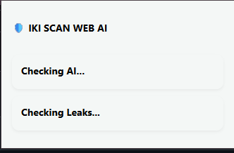
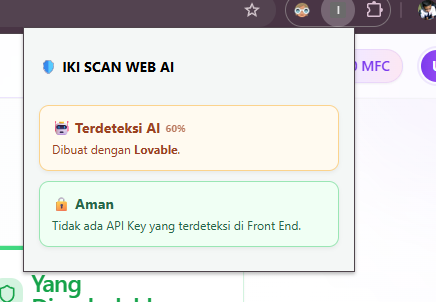
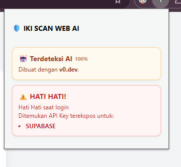
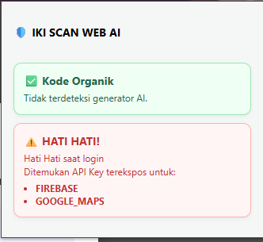

# 🛡️ IKI SCAN WEB AI (BETA)

**IKI SCAN WEB AI** adalah ekstensi browser (Chrome/Edge) yang dirancang untuk membantu pengguna mengidentifikasi risiko keamanan pada website yang dibuat menggunakan *AI Code Generators* (seperti v0.dev, Bolt.new, atau Lovable). Ekstensi ini secara otomatis memindai potensi kebocoran API Key yang terekspos secara ceroboh di sisi Frontend.

---

## 🔍 Mengapa Ini Penting?

Banyak developer yang menggunakan bantuan AI seringkali langsung mempublikasikan kode mereka tanpa menyadari bahwa variabel sensitif diletakkan langsung di kode Frontend. Tanpa konfigurasi keamanan yang benar—seperti **Row Level Security (RLS)** pada Supabase—siapapun bisa mengambil kunci tersebut dan mengeksploitasi database atau menghabiskan kuota API Anda.

---

## ✨ Fitur Utama

* **AI Signature Detection**: Mendeteksi jejak kodingan unik dari platform v0.dev, Bolt.new, dan Lovable.
* **Multi-API Leak Scanning**: Memindai berbagai jenis kunci layanan populer, termasuk:
* **Supabase** (Anon/Service Role Keys)
* **Firebase & Google Maps**
* **OpenAI** (Secret Keys)
* **Stripe** (Public/Secret Keys)


* **Privacy-First Detection**: Mendeteksi dan menginfokan jenis kunci yang bocor **tanpa menampilkan isi kunci** tersebut di layar untuk menjaga keamanan pengguna.
* **Confidence Scoring**: Memberikan skor persentase keyakinan sistem bahwa sebuah web dibuat oleh AI.
* **Professional UI**: Tampilan bersih dengan indikator risiko berbasis warna (Hijau, Kuning, Merah).

---

## 🚀 Cara Instalasi (Manual)

1. **Download/Clone** repositori ini ke komputer Anda.
2. Buka Google Chrome dan akses ke halaman `chrome://extensions/`.
3. Aktifkan **Developer Mode** di pojok kanan atas.
4. Klik tombol **Load Unpacked**.
5. Pilih folder tempat Anda menyimpan file project ini.
6. Ekstensi siap digunakan! **Pin** ekstensi di toolbar untuk akses cepat.

---

## 🛠️ Tech Stack

* **Manifest V3**: Standar ekstensi Chrome terbaru untuk keamanan dan performa maksimal.
* **JavaScript (Vanilla)**: Tanpa dependensi pihak ketiga untuk menjaga kecepatan pemindaian.
* **Custom Regex Engine**: Pola ekspresi reguler yang dioptimalkan khusus untuk mendeteksi berbagai jenis JWT dan API Keys.

---

## 📄 Struktur Folder

```text
/
├── manifest.json    # Konfigurasi utama ekstensi
├── content.js       # Script pemindai konten halaman (Content Script)
├── popup.html       # Antarmuka pengguna (UI)
├── popup.js         # Logika interaksi dan tampilan UI
└── README.md        # Dokumentasi project

```

---
## SnapShot





## ⚠️ Disclaimer

Project ini dibuat untuk **tujuan edukasi dan riset keamanan**. Pengembang tidak bertanggung jawab atas penyalahgunaan informasi yang ditemukan melalui alat ini. Jika Anda seorang developer, selalu gunakan **Environment Variables** di sisi server dan aktifkan kebijakan keamanan database (seperti RLS) untuk perlindungan maksimal.

---

**Dibuat dengan ❤️ untuk komunitas developer yang lebih aman.**

---
